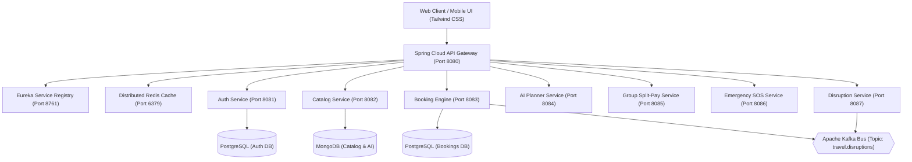

<<<<<<< HEAD
# TripNexus
=======
# TripNexus ? Distributed Travel Booking & Disruption Operating System

> **College Minor Project Submission ? B.Tech Computer Science & Engineering (2026)**  
> **Student Developer:** Vivek Awasthi  
> **Inspired By:** Expedia, Sabre, Amadeus GDS, IRCTC  
> **Architecture:** Microservices, Event-Driven Streaming, Hybrid Cloud, Agile Scrum  

---

## Executive Summary & Motivation

Traditional Online Travel Agencies (OTAs) like Expedia, MakeMyTrip, and Booking.com were built on legacy, siloed monolithic architectures. They suffer from:
1. **Zero Coordinated Split Payments:** Group travelers must manually collect money using external apps like Splitwise.
2. **Static Search Instead of Smart Planning:** Users waste hours manually stitching together flights, hotels, and daily sightseeing schedules.
3. **No Traveler Safety Infrastructure:** When disasters or medical emergencies hit travelers in unfamiliar cities, OTAs provide zero geo-located medical or police assistance.
4. **Ignored Carbon Footprint:** Carbon emissions are either completely omitted or hidden behind obscure greenwashing checkboxes.
5. **Slow, Opaque Disruption Handling:** Flight/train delays and cancellations lead to tedious customer service calls and 7-14 day refund delays.

**TripNexus** is an enterprise-grade, distributed travel operating system designed to solve these exact gaps through modern cloud-native architectures, real-time event streaming, and responsive cyber-glassmorphism design.

---

## Key Differentiators: TripNexus vs. Expedia

| Innovation Dimension | Legacy OTAs (Expedia / MMT) | TripNexus Enterprise Platform | College Viva Talking Point |
| :--- | :--- | :--- | :--- |
| **Trip Planning** | Pure search box filters; user plans manually | **Autonomous AI-Smart Itinerary Planner** generates day-by-day morning/afternoon/evening schedules within budget & vibe | Saves 90% itinerary creation time via generative heuristics |
| **Group Travel Billing** | Single credit card pays 100%; manual payback | **Group Trip & Automated Split-Pay Ledger** with invite links (`TRIP-702`), live member tracking, and SMS nudges | Eliminates awkward bill-splitting; ACID ledger consistency |
| **Traveler Safety** | None | **Emergency SOS Assistant & Radar Scanner** geofencing verified 24/7 trauma hospitals & police stations + live GPS sharing | Duty of Care standard compliance for solo and female travelers |
| **Eco-Mobility Impact** | Hidden or non-existent | **Eco-Nexus Multi-Modal Comparator** showing Flight vs Train vs EV Bus emissions in kg CO2 (-88% rail savings) | Promotes sustainable tourism aligning with UN SDG Goal 13 |
| **Disruptions & Delays** | Delayed emails; 7-14 days manual refund | **Kafka-Driven Disruption Engine** with instant 1-click 100% wallet refunds | Event-driven microservices architecture using Apache Kafka |
| **B2B Agent Console** | Rigid consumer-only interface | **Role-based Agent Portal** allowing custom tour bundling and real-time commission markup configuration | Dual B2C and B2B capabilities for commercial viability |

---

## System Architecture & Microservices Topology



---

## Microservices Breakdown

| Service Name | Port | Primary Tech Stack | Database / Broker | Responsibility |
| :--- | :--- | :--- | :--- | :--- |
| `service-registry` | `8761` | Netflix Eureka Server | In-Memory Heartbeat | Dynamic microservice discovery and health monitoring |
| `api-gateway` | `8080` | Spring Cloud Gateway, WebFlux | Redis Reactive Cache | Edge routing, SSL termination, and rate-limiting |
| `auth-service` | `8081` | Spring Boot 3, Spring Security | PostgreSQL / JWT | Role-based authentication (`CUSTOMER`, `AGENT`, `ADMIN`) |
| `catalog-service` | `8082` | Spring Boot 3, REST API | MongoDB Document Store | Multi-modal inventory for flights, hotels, trains, and buses |
| `booking-service` | `8083` | Spring Data JPA, Kafka Producer| PostgreSQL (ACID) | Guaranteed seat reservations, PNR generation, wallet deduction |
| `planner-service` | `8084` | Generative Engine, Spring Boot | MongoDB Document Store | AI-driven day-by-day customized trip schedule optimization |
| `group-service` | `8085` | Spring Boot 3, WebSockets | PostgreSQL | Group split-ledger calculations and invite code verification |
| `safety-service` | `8086` | Spring Boot, Haversine Engine | Redis Geo / Google Maps | 5km geofenced radar scanning for verified hospitals & police |
| `disruption-service`| `8087`| Spring Kafka Listener/Producer | Apache Kafka (9092) | Broadcasts flight/train delays and automates 1-click refunds |

---

## Agile Scrum Methodology

The project was engineered using **Agile Scrum Methodology** across 4 sprints:
- **Sprint 1 (Architecture & Skeleton):** Microservices scaffolding, Eureka discovery, Spring Cloud Gateway routes, and Docker compose configuration.
- **Sprint 2 (Inventory & Booking Engine):** Multi-modal catalog data structures (Flights, Hotels, Vande Bharat, Electric Buses), PNR generation, and digital boarding pass rendering.
- **Sprint 3 (The 5 Differentiators):** Generative AI planner algorithm, Group split-pay ledger, SOS emergency radar, Eco-comparator, and Kafka broadcast simulator.
- **Sprint 4 (UI/UX Polish & Role-Based Portals):** Dark Obsidian glassmorphic styling, B2B Agent package builder, Super Admin cluster monitor, and college presentation readiness.

---

## Quick Launch Guide

### Option 1: Instant Interactive Presentation (Zero Setup)
Simply open the client interface in any modern browser:
```powershell
# Double click or run in terminal:
Start-Process "D:\TripNexus\index.html"
```
*No Node.js or npm installation required ? runs directly with CDN dependencies!*

### Option 2: Full Distributed Backend (Docker)
Ensure Docker Desktop is running, then execute:
```powershell
cd D:\TripNexus
docker-compose up -d
```
All infrastructure components (Postgres, MongoDB, Redis, Kafka, Zookeeper, Zipkin) will initialize automatically.

---

## Author & Academic Credits
- **Project Lead:** Vivek Awasthi
- **Degree:** Bachelor of Technology in Computer Science & Engineering
- **Project Type:** College Minor Project Submission (2026)
>>>>>>> fd8b7be (initial)
